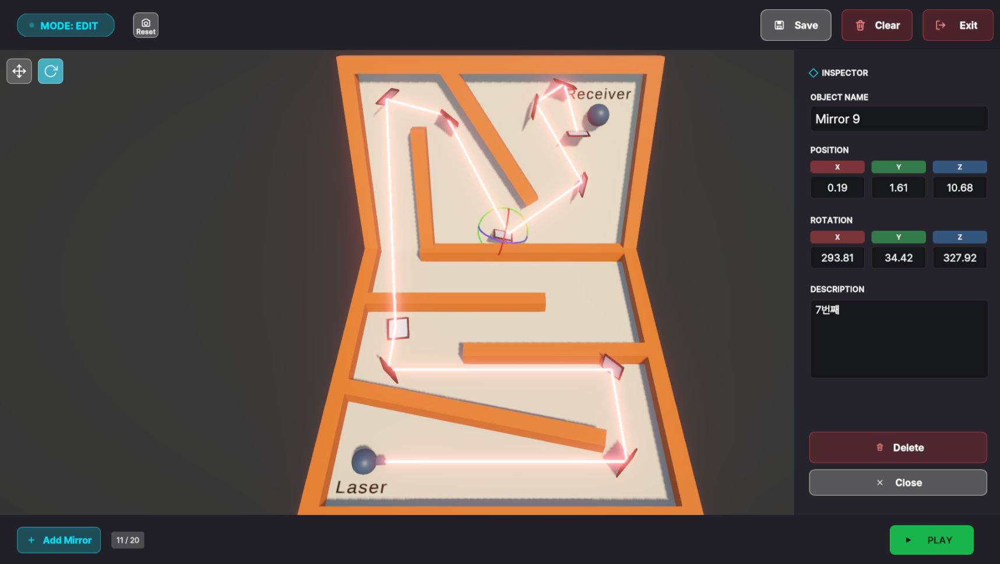
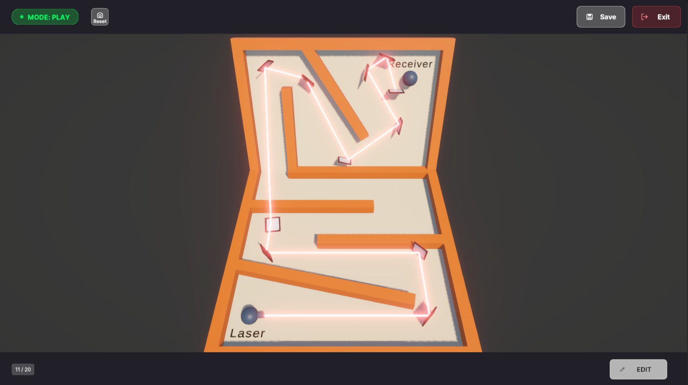
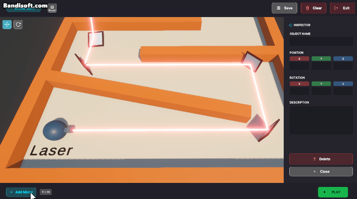
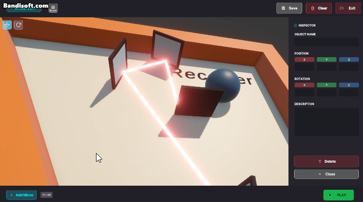
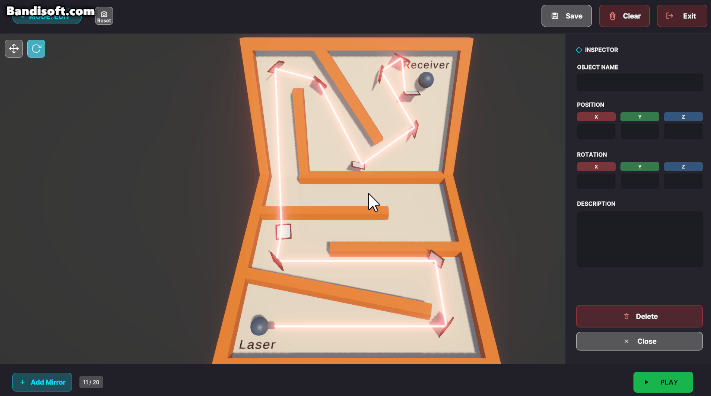
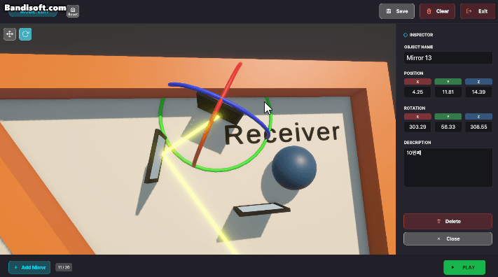

# Deepfine 입사 지원자 대상 사전 과제

Edit. 2025-12-17

<details>
<summary>과제 내용</summary>
<div markdown="1">

## 1. 개요
최근 AI 활용이 보편화되면서 단순 코드 완성도만으로는 평가가 어렵습니다.  
본 과제는 구현 과정에서 드러나는 **프로그래밍 스타일, 구조 설계, 확장 가능성, 디자인 패턴 활용, 디버깅/테스트 관점** 등을 종합적으로 확인하기 위한 목적입니다.
하여 요구 사항대로 정상 작동과 함께 프로젝트 구성에 중점을 두고 있습니다.

## 2. 목표
플레이 타임에 Mirror(Prefab) 를 설치/조작하여, Laser가 발사되어 Receiver까지 도달하도록 시스템을 구현합니다.
  
## 3. 요구사항
### 공통
- 프로젝트 내 Laser, Mirror, Receiver에 자유롭게 아래 요구 사항을 구현합니다.
- 사용 된 Unity는 6000.2.7f2
### Laser
- Collider가 있는 GameObject에 닿으면 충돌 지점까지 그려져야 합니다.
- Mirror에 닿을 시 정반사가 됩니다.
- 반사는 최대 10회까지 수행 되도록 제약 조건을 구현하여야 합니다.
### Receiver
- Laser가 Receiver에 닿으면 상태 변화가 발생해야 합니다. (상태 변화는 색상, 연출 등 자유)
- Laser가 닿지 않으면 원래 상태로 자동 복귀해야 합니다.
### Mirror
- Mirror는 플레이 타임에 동적으로 공간 상 설치 가능해야 합니다. (클릭, 단축키, UI 버튼 등 자유)
- Mirror는 Position / Rotation 조작이 가능해야 합니다. (Gizmo, 드래그, 단축키 등 자유)

## 4. 제출물
- 본 Git Repo를 Fork해서 본인 계정의 Git에서 수행 후 링크 공유.
- README를 통해 간단한 구조 설명 및 조작 방법 공유
</div>
</details>


---

# 구현 결과

## 조작 방법

**모드 전환**
| Edit 모드 | Play 모드 |
|---|---|
|  |  |
- 화면 우측 하단에 `Edit`/`Play` 버튼으로 전환. 좌측 상단에 현재 모드가 표시됨.
- `Play` 모드에서는 거울 선택과 Inspector 조회만 가능하고, `Edit` 모드에서는 배치·이동·회전·삭제까지 가능함.

**거울 배치 (Edit 모드)**
- `Add Mirror` 버튼 → 배치 모드 진입 → `Floor` 레이어 위 아무 곳이나 클릭하면 표면 법선에 맞춰 배치
- 배치 중 마우스 우클릭 또는 `Esc`로 취소.
- 최대 배치 개수에 도달하면 추가 배치가 불가능함.

**거울 조작 (Edit 모드)**
- 배치된 거울을 클릭하면 선택되고, 우측 Inspector 패널에 Name/Position/Rotation/Description이 표시됨 
- Inspector 패널에서 직접 입력 또는 기즈모 조작으로 Transform 조작 가능하며 양방향 동기화되어 있음.
- `viewport` 영역 좌측 상단 `Edit Option (Position/Rotation)` 버튼 조작 가능 (단축키 `W`/`E`)
- 이동·회전: 축별 핸들을 드래그 (Position-큐브, Rotation-링)
- 개별 삭제: Inspector 패널의 `Delete` 버튼, 키보드 `Delete` 키
- 전체 삭제: 우측 상단 `Clear` 버튼 (런타임에만 반영되며, 영구 반영하려면 `Save`를 눌러야 함).
- Inspector 패널은 하단 `Close` 버튼으로 닫고, 거울을 다시 클릭하면 열림.

| 예시 1 | 예시 2 |
|---|---|
|  |  |

**저장/불러오기**
- `Save` 버튼: 현재 배치(Position/Rotation/Name/Description)를 JSON으로 저장.
- 앱을 처음 실행하면 부트스트랩 씬(`Init`)이 저장된 배치를 읽고 게임 씬으로 진입 (저장 파일이 없거나 손상된 경우 빈 상태로 시작.)

**카메라**
- 회전: 마우스 우클릭 드래그
- 확대/축소: 스크롤
- 이동: 휠 버튼(가운데 클릭) 드래그
- 리셋: 좌측 상단 카메라 아이콘 버튼



**레이저**
- 초록색: Receiver에 도달
- 빨간색: 최대 반사 횟수까지 도달하고도 Receiver에 도달하지 못한 경우
- 노란색: 아직 반사 기회가 남아있는 상태



**기타**
- 우측 상단 `Exit` 버튼: 애플리케이션 종료(에디터에서 테스트 중이면 Play 모드만 종료).

## 프로젝트 구조

```
Assets/Scripts/
├─ Laser/        레이저 시뮬레이션(LaserEmitter), 수신기(LaserReceiver), 반사/수신 인터페이스
├─ Mirror/       거울의 반사 로직(MirrorController, ILaserReflector 구현)
├─ Placement/    거울 배치·풀링(MirrorPlacementController, MirrorPool, PlacedMirror), 개수 표시
├─ Selection/    선택·기즈모 조작(MirrorSelectionController, MirrorGizmo), Inspector 패널
├─ Save/         JSON 저장/불러오기(SaveManager, LoadManager)
├─ Motions/      범용 DOTween 연출 컴포넌트(CanvasGroupAlphaLoop)
└─ (최상위)      GameManager, GameConfig, MonoSingleton, AppMode 등 앱 전역 매니저·설정
```

씬 구성
- `Init`: 항상 최초 실행되는 부트스트랩 씬으로 저장 데이터 로드 후 `Scene`으로 전환
- `Scene`: 실제 플레이 씬

## 아키텍처 설계

핵심 결정들만 요약하며, 각 결정의 배경·트레이드오프·왜 다른 대안을 기각했는지는 `Docs/ImplementationNotes.md`에 자세히 기록되어 있습니다(`Docs/Roadmap.md`는 무엇을 했는지, `ImplementationNotes.md`는 왜 그렇게 했는지를 담당).

1. **인터페이스로 레이저 로직을 분리** — `LaserEmitter`는 구체적인 `Mirror`나 `Receiver` 타입을 몰라도 되도록 `ILaserReflector`(반사체가 정의하는 정면 벡터)와 `ILaserHitReceiver`(피격 콜백)에만 의존. 반사체/수신체 종류가 늘어나도 `LaserEmitter`는 수정할 필요가 없음.
2. **오브젝트 풀링** — `MirrorPool`이 활성 거울은 `List`, 비활성 거울은 `Queue`로 관리해 `Instantiate`/`Destroy` 대신 `SetActive`로 재사용. `PlacedMirror.ActiveCount`가 이 풀과 별개로 재사용 시점(`OnEnable`/`OnDisable`)마다 개수를 집계.
3. **Raycast 기반 자유 배치** — 격자 스냅 없이 `Floor` 레이어의 어떤 콜라이더든 클릭 지점의 표면 법선에 맞춰 배치. 최초 배치 시에는 Floor에 도킹되도록하고 이후에는 자유롭게 Transform 수정 가능. `Floor`/`Mirror`/`GizmoHandle` 레이어를 분리해 배치·선택·레이저 레이캐스트가 서로 간섭하지 않도록 함.
4. **이벤트 기반 상태 전파** — 컴포넌트끼리 결합도를 낮추기 위해 직접 참조해 메서드를 호출하는 대신 이벤트를 발행/구독하는 방식으로 연결(모드 전환, 선택 변경, 기즈모 모드, 활성 개수, 배치 한도 도달 등). `GameManager.Mode`/`MirrorGizmo.Mode`처럼 앱 전역에서 반복 참조되는 상태는 `PlacedMirror.ActiveCount`와 같은 방식으로 `static`으로 노출해, 소비하는 쪽이 매번 인스턴스 참조를 연결하지 않아도 되게 함.
5. **설정값 중앙화** — 레이저 최대 반사 횟수, 거울 최대 배치 개수처럼 여러 클래스가 참조하는 값은 `GameConfig`(`ScriptableObject`, `Resources` 폴더에 두고 정적 싱글톤으로 로드) 하나로 모아, 값 하나만 바꾸면 모든 참조처에 반영되고 별도 필드 연결도 필요 없게 함.
6. **데이터 영속성** — `SaveManager`가 `JsonUtility`로 배치 정보를 저장. 불러오기는 버튼이 아니라 앱 실행 시 항상 거치는 부트스트랩 씬 `Init`의 `LoadManager`(재사용 가능한 `MonoSingleton<T>` 기반 `DontDestroyOnLoad` 싱글톤)가 처리하고, 파싱 결과를 들고 게임 씬으로 넘어가 `GameManager`가 실제 스폰을 담당.
7. **안전장치** — 레이저 자기 충돌 방지 오프셋, `ILaserReflector.ReflectiveNormal` 기반 앞/뒷면 판별(볼록 콜라이더는 항상 진입면만 히트되므로 단순 Dot 비교로는 구분 불가), `InputFocusGuard`로 InputField 편집 중 키보드 단축키(W/E/Esc/Delete)가 오작동하지 않도록 방지.
